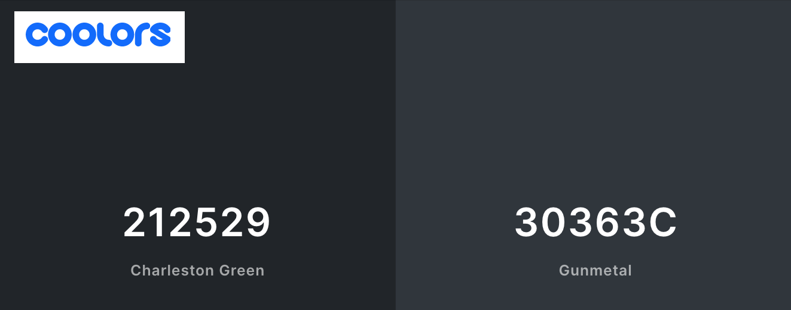
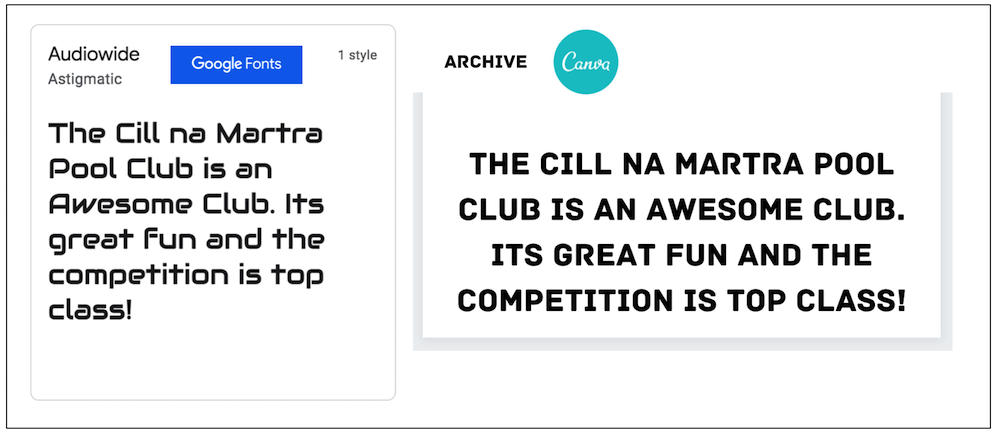

#####   #####

# Cill na Martra Pool Club (CPC) :8ball: #
## A web application for managing the members and leagues of a fictional Pool Club ## 
### Purpose: Backend Development Project (Milestone Project 3) for the Diploma in Software Development course at [Code Institute](https://codeinstitute.net/) ###
### Developer: Andrew McDonald - Contact me on GitHub :octocat: @ <a href="https://github.com/AndyMc3000"><strong>AndyMc3000</strong></a> ###
### Website deployed on an Heroku App: [Click Here](https://pool-club.herokuapp.com/) ###

# Table of Contents #
1. [Introduction](#introduction-heading)
1. [User Experience Design (UX)](#user-experience-design)
1. [Development Process](#development-process)
1. [Website Features](#website-features)
1. [Technologies Used](#technologies-used)
1. [Testing & Bugs](#testing)
1. [Deployment](#deployment)
1. [Credits](#credits)
 

####   ####
## 1. <a name="introduction-heading">Introduction</a> ##
####   ####

The Cill na Martra Pool Club (hereafter called CPC) website is my Milestone 3 (MS3) project for the Diploma in Fullstack Software Development course at Code Institute. The underlying goal of the project is to meet and exceed the requirements laid out for the MS3 project by Code Institute. The high-level requirement of the MS3 project is to "..build a full-stack site that allows your users to manage a common dataset about a particular domain. Users make use of the site to share their own data with the community, and benefit from having convenient access to the data provided by all other members." 

This README refers to CPC as a fictional client of mine, where I have been hired to develop a website for CPC to meet certain criteria (see the User Experience Design section below). CPC is a small Pool Club with members based around a number of parishes close to Cill na Martra in Co.Cork, Ireland. Club members meet weekly at a number of local pubs to play pool. Membership numbers fluctuate between roughly 25 to 50 players. CPC runs a Pool League twice yearly. Members arrange to meet at a venue to play league matches, which comprise of playing the best out of 5 games format. A Referee must also be present at league matches. Any other member can referee a match.

Managing members and pool league data was traditionally paper-based, and was a headache for those members who were 'voluntold' to manage that job. The club want a simple web-based application to make it easy for members to; 
* Manage a league table.
* To allow members to get real-time match/league result information.
* To allow members to easily get contact information for players for the purpose of scheduling matches.

The principle languages used in the development of the site are; HTML5, CSS3, JavaScript, and Python.

Other technologies include; 
* The Bootstrap front-end CSS framework.
* The jQuery JavaScript library.
* The Flask Python web framework.
* The Jinja templating language for Python.
* The MongoDB NoSQL database program.
* The Heroku cloud Platform-as-a-Service.
* The EmailJS email service.

#### [Back To Top ^ ](#top-of-page) ####

####   ####
## 2. <a name="user-experience-design">User Experience Design (UX)</a> ##
####   ####

The design of the CPC website was determined by assessing and quantifying the goals and objectives of the club organisers ('client stories'), as well as the requirements of players who will visit and use the site ('user stories'). Following the determination of client and user stories and their subsequent technical requirements, the site was designed using the principles of Jesse James Garrett's '5 Planes of UX Design'. The outcome or tasks created for each of the 5 design planes is outlinined below.

### 1. The Strategy Plane ###

The Strategy Plane, as defined by Jesse James Garrett "..incorporates not only what the people running the site want to get out of it but what the users want to get out of the site as well." 

Please see below details of the 'Client Stories' to detail the requirements of the CPC, and the 'User Stories' which highlight the requiremnts of club members/players.

#### Client Stories ####
> - [x] “One of the main goals of the website is to grow the membership of Cill na Martra Pool Club, and to provide value to visitors in the information is provides about the CPC.”
> - [x] “The website must also give Club organisers a one-stop-shop to create and manage Pool Leagues, League Matches, and Players/Members.”
> - [x] “The website must allow users on the site to view both current and archived League Tables.” 
> - [x] “The website must allow new members to register and join the Club.” 
> - [x] “The website must provide an area where club members can view their current League statistics/progress.”
> - [x] “The website must provide an area where club members can view a list of the current League Matches they have played, and which matches are yet to be played (depending on active membership numbers, a player can expect they will need to play each other player twice in a given League).”
> - [x] “The website must provide an area where club members can add a Match result when they have acted as a Match Referee.”
> - [x] “The website must provide an area where club members can find contact details of another Player in order to arrange a Match date/time/venue.”
> - [x] “The website must provide an area where club members can view their League statistics for previous (archived) Leagues.”
> - [x] “The website must provide an area where club members can edit and update their Account information.”
> - [x] “The website must provide an area where site Admininstrators can add a new League."
> - [x] “The website must provide an area where site Admininstrators can add a new Player/Member."
> - [x] “The website must provide an area where site Admininstrators can make a Player/Member an Administrator."
> - [x] “The website must provide an area where site Admininstrators can edit or delete a League."
> - [x] “The website must provide an area where site Admininstrators can edit or delete a Player."
> - [x] “The website must provide an area where site Admininstrators can edit or delete a Match."
> - [x] “The website must allow users to find contact details for Club organisers and include a Contact Us form.”
> - [x] “The website must have a section showing banner adverts for CPC sponsors.”
> - [x] “The website must be mobile-friendly.”
> - [x] “The website colours must be dark. The website will be used by Players at Match events on their mobile phones, and so a dark colour scheme will ensure that viewing the website while near a pool table will reduce the risk of Player distraction.”

#### User Stories ####
> - [x] “I want to learn about what the CPC is.”
> - [x] “I want to be able to view current and archived CPC League Tables.”
> - [x] “I want to be able to register and sign-up to join the CPC.”
> - [x] “Once I'm sined-up and logged in, I want to be able to view my personal League statistics - current League Rank, current League Points, current Matches won/lost, current Games won/lost, current Matches played, and Matches remaining.”
> - [x] “I want to be able to view my personal League statistics - League Rank, League Points, Matches won/lost, Games won/lost, Matches played, and Matches remaining.”
> - [x] “If I act as a Referee for a League Match, I want to be able to record the Match result and update the current League Table.”
> - [x] “I want to be able to view my list of Leagues Matches, both those Matches Played and those Matches yet to be played."
> - [x] “I want to be able to find contact details for other players so that I can arrange my Matches as/when required."
> - [x] “I want to be able to edit and update my Account information."

### 2. The Scope Plane ###

Based on the outcomes from the Strategy Plane, The Scope Plane determines what features, functionality, and types of content should be included within the scope of the project. Listed below are the functional specifications and content requirements decided upon for the CPC website. 

#### Functional Specifications: ####
* Build a responsive Website with 3 main pages - a Homepage, a Player Homepage, and an Admin homepage. Each of these pages should have a selection of 'feature views'/pages linked from them. The Homepage should have 4 page views linked from it, those being; 'Login', 'Current League Table' 'League Archive', and 'Register'. The Player Homepage should have 6 page views linked from it, those being; 'My League Stats', 'My Match List', 'Add Match Result', 'Find A Player', 'My League History', and 'Edit My Account'. The Admin Homepage should have 6 page views linked from it, those being; 'Add League', 'Add Player', 'Add Admin', 'Edit League', 'Edit Player', and 'Edit Match'.  

* All Pages:  
   * All pages should include a Navigation bar to highlight the currently accessed page. The Navigation bar should have 3 different views; One for a non-logged in user, one for a logged in registered player, and one for an Admin user.
   * All pages should include a carousel with scrolling banners adverts for CPC sponsors at the bottom of the page.
   * All pages should include a Footer section which simply has a CPC logo which links to the Homepage, and copyright information. 
* Homepage, Registration page, Login page, and League Table pages:  
   * The Homepage should include and introduction section and a 'why join us?' section, which should introduce the club and promote the benefits of joining it. 
   * The Homepage should also have an 'Our Leagues' which describes what the Leagues are and how often they are run. This section should also include button links to pages to view; 1. The current/active League Table, and 2. Archived League Tables.
   * The Homepage should include a Contact Us section to show name, telephone, and email contact infromation for the CPC organisers, as well a contact form.
   * The Register page should have a form which allows a new member to input their; First Name, Nickname, Surname, Telephone Number, Email Address, a Password, and it should also include a Confirm Password field. On clicking a Register button, a user will create a new document in a 'user' collection of a MongoDB database.
   * The Login page should have a form where a User can input their email address and password. On clicking a "log In' button, the user should be redirected to their Player Homepage.
   * The Current League Table should show a table showing up-to-date data for all members in the current League. This table should include columns with headings for; Rank, Player Name, Points, Matches Won, Matches Lost, and Matches Remaining.
   * The League Archive page should include a dropdown box where a user can select the name of a League which which has an end date in the past. On clicking a 'view League' button, the data for the League Table for that League will populate a table on the page (in the same format as the above 'Current League Table').
* Player Homepage:
   * The 'My League Stats' page should include a table which shows a Players individual current League statistics including their: Rank, Points, Matches Played, Matches For, Matches Against, Games For, and Games Against.
   * The 'My Match List' page should include a table which shows a list of all a Players League fixtures. The table should include columns with headings for: Number, Player Name, Matches. All Players in the League should be listed, and the Matches column shoud show a 0, 1, or 2 to indicate the number of Matches played against an individual Player. Note: In a League, all Players will need to play to every other player twice.
   * The 'Add Match Result' page should contain a form where a Player can results of a Match from the current League. The form should contain the following fields; Match Date, Match Referee, Player One, Player One Frames Won, Player Two, Player Two Frames Won. On clicking a 'Add Result' button, the Player would then create a new Match document in the Matches collection on a MongoDB database.
   * Find a Playershould include a form where a player can add Match details to a Matches collection on a MongoDB database. A Player can pick a match date from a date picker field. Then they can select the following from a series of dropdowns; Referee, Player One, Player On Frames Won, Player Two, Player Two Frames Won. On clicking a 'Add Result' button, they would then create a new document in the Matches collection. 
   * The 'My League History' page should include a dropdown box where a Player can select an Archived League. On clicking 'View Stats' button, a table should be populated with a Players statistics from that League. This table should show their: Rank, Points, Matches Played, Matches For, Matches Against, Games For, and Games Against.
   * The 'Edit My Account' page should include a form which pre-populates with a Players Account information. A Player can edit the details on the form. These details being; First Name, Nickname, Surname, Telephone Number, Email Address, and Password. On clicking a update details button, a user will update their document in the user collection on MongoDB.
* Admin Homepage:
   * The 'Add League' page should contain a form where an Admin can input; League Name, League Description, Start Date and End Date.
   * The 'Add Player' page should contain the same form as in the Register page. This feature may be required when a person wants to join the club but is not computer savvy. And so an Admin can then register the user on their behalf. 
   * The 'Add Admin' page should contain a dropdown where an Admin can select a Player. On clicking a 'Make Admin' button an Admin then updates the admin value in a user document on MongoDB. The value will be updated from 'false' (the default value) to 'true. 
   * The 'Edit Player' page should contain a dropdown where an Admin can select a Player. On clicking a 'Select Player' button a form will be populated containing the same Player form data as in the 'Edit My Account' page. An Admin can then edit the account details of a player. On clicking a "Edit Player' button an Admin can then update a Players document in the user collection of a MongoDB database. Alternatively an Admin can also click a 'Delete Player' button which will delete a Player document from the user collection in a MongoDB database.  
   * The 'Edit League' page should contain a dropdown where an Admin can select a League. On clicking a 'Select League' button a form will be populated containing the following data about that League; League Name, League Description, Start Date and End Date. An Admin can then edit the League details. On clicking a "Edit League' button an Admin can then update a Leagues document in the league collection of a MongoDB database. Alternatively an Admin can also click a 'Delete League' button which will delete a League document from the league collection in a MongoDB database.  
   * The 'Edit Match' page should contain a dropdown where an Admin can select a Match from the current League. On clicking a 'Select Match' button a form will be populated containing the following data about that Match; Date, Referee, Player One, Player On Frames Won, Player Two, Player Two Frames Won. An Admin can then edit the infromation contained in those fields. On clicking a 'Edit Match' button, they would then update the Match document in the Matches collection on a MongoDB database. Alternatively an Admin can also click a 'Delete Match' button which will delete a Match document from the Matches collection in a MongoDB database.  

#### Content Requirements: ####
* The images used on the Homepage Carousel should show people playing pool. The images should be colourful and 'exciting', in order to entice new members. 
* The 'Why Join' section on the Homepage should briefly, but completely, convey what the benefits are of joining the Club. 
* The 'Why Join' section should also contain appropriate images and texts contained within Bootstrap cards to reinforce the 'Why Join' messaging.
* The 'Our Leagues' section on the Homepage should briefly, but completely, describe what the Club Leagues are and how often they are. 
* This 'Our Leagues' section should also contain Bootstrap cards which contain images, texts, and link buttons which link to the Current League Table page, and the Archived League Tables page.
* The Contact Us section should include text to describe how the Club can be contacted, and this should be placed above a Contact Form.
* The 'Visit our Sponsors' scrolling carousel section should contain a selection of attractive sponsor marketing banners, and include links to the external sponsor websites.
* The Footer section should contain a single CPC logo which also serves as a link to the Homepage.

### 3. The Structure Plane ###

#### Interaction Design: ####

Interaction design is defined as the "..development of application flows to facilitate user tasks, defining how the user interacts with site functionality". Inline with this principle, the pages were designed as follows;

* The Homepage and linked pages/views;
* It should have a navigation bar with individual links to the Registration and Login pages. The navigation bar should also be fixed to the top of the page view.
* The 'hero' carousel banners at the top of the Homepage should include a link button linking to the Registration page.
* The 'Why Join' section should also contain a link button linking to the Registration page.
* The 'Our Leagues' section should contain two link buttons. One button should link a user to the current League Tabel page, and the other should link a user to the Archived League Tables page.
* On completion and submission the Contact Form should send an email (cc'ing the user) to a CPC organiser using the EmailJS email service. 
* The sponsor carousel banners in the 'Visit our Sponsor' section should be clickable and link a user to an external sponsor website, where that page opens in a new browser window/tab.
* The Current League page should have back buttons above and below the League Table container and link a user back to the Homepage.
* The Login page should have back buttons above and below the Log In form container and link a user back to the Homepage.

* The Player Homepage and linked pages/views;
* Once a Player is logged in and is rerouted to their Player Homepage, the navigation bar should change and show individual links for; Home (Homepage), MyHome (Player Homepage), and Log Out (rerouting a user to the Login page).  
* The Player Homepage should have individual Bootstrap cards with clearly visible link buttons for each function a user can perform there.
* Each function listed on the Player Homepage should have its own page.
* Each of the function pages should have a 'Back' button positioned both below and above the content area, returning a Player to their Player Homepage. The function pages to be included are: 'My League Stats', 'My Match List', 'Add Match Result', 'Find A Player', 'My League History', and 'Edit My Account'.

* The Admin Homepage and linked pages/views;
* If a Player is also an Admin, and once that Player is logged in and is rerouted to their Player Homepage, the navigation bar should change and show individual links for; Home (Homepage), MyHome (Player Homepage), Admin (Admin Homepage) and Log Out (rerouting a user to the Login page). 
* The Admin Homepage should have individual Bootstrap cards with clearly visible link buttons for each function a user can perform there.
* Each function listed on the Admin Homepage should have its own page.
* Each of the function pages should have a 'Back' button positioned both below and above the content area, returning an Admin to their Player Homepage. The function pages to be included are: 'Add League', 'Add Player', 'Add Admin', 'Edit League', 'Edit Player', and 'Edit Match'.

#### Information Architecture: ####

Information Architechture is defined as; "The structural design of the information space to facilitate intuitive access to content" (Copyright 2000 James Garrett).

With this in mind, please see details below about the sites sitemap, how data is stored and managed, and about navigation and security considerations.
* ##### Sitemap #####
The structure of the website is outlined in the Sitemap. Click here to view the <a href="assets/readme-assets/cpc-sitemap.png"><strong>Sitemap.</strong></a>

* ##### Data #####
The CPC website should be designed to allow a user to create, read, update, and delete data intuitively and quickly. CPC will use a NoSql MongoDB Atlas database to store all data. The database will be called 'pool_club'. It will store data in four Collections named: 'user', 'league', 'matches', and 'archive'. Each Collection will contain documents with unique 'id's, storing key:value pairs of relevant information. The user functions/actions on the CPC site will interact with and/or populate the documents with relevant values.

* The 'user' collection should store information relating to registered club members, or Players. The keys in this collection will be;
  * 'firstname', 'nickname', 'surname', 'email', 'telephone', 'password', 'admin', 'rank', 'points' 'matches_played', 'matches_won', 'matches_lost', 'games_won', 'games_lost, and 'entered_leagues' 

* The 'league' collection should store information relating to the current league (the current league is that which has an end date in the future but a start date in the past). The keys in this collection will be;
  * 'name', 'description', 'start_date', 'end_date', and 'participating_players' 
  
* The 'matches' collection should store information relating to individual matches played. The keys in the documents of this collection will be;
  * 'player_one', 'player_two', 'player_one_won', 'player_two_won', 'date', 'league', 'created_by', and 'referee' 
 
# TO DO #
* The 'archive' collection should store information relating to leagues with an end date in the past. This collection will store a list of leagues. The keys in each list item in this collection will be;
  * 'league_id', 'league_name', 'end_date', 'start_date', ' 'player_two_won', 'date', 'league', 'created_by', and 'referee'
  
The Data Types for each value in the Collections can be seen in the Database Schema <a href="readme-assets/cpc-database-schema.md"><strong>Here.</strong></a>

* ##### Navigation & Security #####
* The CPC website should also be designed to allow users to easily and securely navigate throughout the site. For example, the navigation bar should be fixed to the top of the page view so that it is always immediately accessible. 
* Buttons and links should be clearly visible and communicate their purpose in an unambiguous way. 
* Function pages should have 2 'Back' buttons situated at the top and bottom of the page view to allow for an easy back and forth between pages.
* The site should not all users to access areas without privileges. For example, a user should not be able to access another users Player Homepage or be able to edit another players account details. Or, A non-Admin should not be able to edit matches or access the Admin Homepage.
* MongoDB Atlas access credentials should not be visible anywhere on the site.
* A user should not be able to access another users password. 

### 4. The Skeleton Plane ###

Following on from the tasks decided upon in the Structure Plane, the Skeleton Plane is defined as follows; ".. The skeleton is designed to optimize the arrangement of these elements (such as the placement of buttons, tabs, photos's and blocks of text) for maximum effect and efficiency..".

With this in mind I created the below wireframes, to detail the layout of the website pages and individual sections/containers etc. Due to the number of pages involved, I created multiple and split them into groups. I created 2 wireframes for the Homepage and the pages directly linked from the Homapgae. I created 2 wireframes for the Player Homepage and the pages directly linked from the Player Homepage. And I created 2 wireframes for the Admin Homepage and the pages directly linked from the Admin Homepage. Please click on the the links below to view these wireframes.

##### Wireframes #####
* Wireframes for the Homepage and related pages;
1. <a href="readme-assets/cpc-homepage-and-linked-pages-wireframes-large.png"><strong>Homepage on Large Screen Devices</strong></a>
1. <a href="readme-assets/cpc-homepage-and-related-pages-wireframes-mobile.png"><strong>Homepage on Mobile Devices</strong></a>

* Wireframes for the Player Homepage and related pages;
1. <a href="readme-assets/cpc-player-homepage-and-linked-pages-wireframes-large.png"><strong>Player Homepage on Large Screen Devices</strong></a>
1. <a href="readme-assets/cpc-player-homepage-and-linked-pages-wireframes-mobile.png"><strong>Player Homepage on Mobile Devices</strong></a>

* Wireframes for the Admin Homepage and related pages;
1. <a href="readme-assets/cpc-admin-homepage-and-linked-pages-wireframes-large.png"><strong>Admin Homepage on Large Screen Devices</strong></a>
1. <a href="readme-assets/cpc-admin-homepage-and-linkeded-pages-wireframes-mobile.png"><strong>Admin Homepage on Mobile Devices</strong></a>

### 5. The Surface Plane ###

Having completed the previous 4 stages in the UX design process, I moved on to making decisions around the design and styling of the website. The Surface Plane focuses on the styling of images, backgrounds, fonts, and colours used on a website. The details of these decisions are listed here;

1. Colours - The color scheme for the website was chosen from a selection of colours I considered using tools on the [Coolors.co](https://coolors.co/) website. I only used 2 dark site colours in order to meet the requirement that the site have dark backgrounds colours. I found a suitable dark colour and the found a tint of that colour to use for the background colours of Bootstrap cards which are used extensively on the site.The colours chosen, along with their HEX values, are shown here;

1. Font - I used the Google Fonts website to help me decide on a font to use for site texts. I decided on a font called 'Audiowide' for all texts. I also used the Canva.com free trial service to help me find a font for my logo (I sourced the image part of the logo elswhere). On Canva I found and used a font called ARCHIVE (Designed by Slava Kirilenko – a graphic designer from Almaty, Kazakhstan) for the logo.   

1. Logo Design - I created the CPC logo using tools on [Canva.com](https://www.canva.com/). The logo contains an image and some text. I got the image from Clipart.com and then uploaded it to Canva where I added the text to produce the final logo.

1. Images - I mainly used photos taken from the [Unsplash.com](https://unsplash.com/) website. On Unspalsh.com I was able to create a collection of relevant phtotos. The naming convention for each photograph includes a referenece to the photographer name and the Unsplash item code. The Alt attribute for each photograph also includes the photographer name.

1. Icons - I used [Font Awesome](https://fontawesome.com/) icons to add icons to section headings. 

1. Favicons - I use the Real Favicon Generator online service to create browser, desktop, and mobile favicons for the site. I uploaded a single favicon image to the Real Favison Generator service, and it generated a package of individual files which I downloaded. I then uplodaed these files to a favicon directory, and added a list of links to the header of my base.html page. These links then served the correct favicon to the appropriate device or browser. Learn more about this service here [RealFaviconGenerator](https://realfavicongenerator.net/)

#### [Back To Top ^ ](#top-of-page) #### 

####   ####
## 3. <a name="development-process">Development Process</a> ##
####   ####

I drew up a process to follow for developing the CPC website. This is listed in sequence below.

1. Design - I firstly designed the site based on the Client/User Stories requirements, and by creating wireframes/sketches etc.
2. Setup - I then setup my GitPod IDE by installing Flask, PyMongo, flask-pymongo, and dnspython. I then created a new Database on MongoDB and added my Collections. I also created a new app on Heroku. I then created an env.py file for my sensitive environment variables, and listed that in my .gitignore file so that it would not be pushed to GitHub. And I created a requirements.txt file so that Heroku would understand what the site/app requirements are. 

# TO DO #
4. Interactive Functionality - I added in any JavaScript elements to the site. Those being; the Google Maps API for a map with custom markers and 'infoWindows'.    A JavaScript Shopping Cart plugin. JavaScript to send form data via email using the EmailJS service. And Bootstrap JavaScript to manage form validation.
5. Content - I then added text content to sections (lorem ipsum/placeholder text), and images to galleries. 
6. Style - I then added colours and fonts and wrote CSS rule sets and media queries in order to style the website and make it responsive.
7. Responsive - I made sure all texts/headings, images, and container elements transform approprately and look good when viewed on different devices such as:        mobile phones, tablets, laptops, large screen PC's, and large TV's. 
8. Review - I did a last review of all code (formatting, beautifying etc) and content, fixing anys bugs/typo's etc as I did so.
9. Testing - I validated my HTML, CSS, and JavaScript code, and tested functionality of site elements across a range of different devices and browsers. I then fixed any bugs found.

#### [Back To Top ^ ](#top-of-page) ####

####   ####
## 4. <a name="website-features">Website Features</a> ##
####   ####

The site employs the following features/functionality;

* Bootstrap Navigation Bar on all pages.
* Bootstrap Carousel on index.html.
* Bootstrap Cards on all pages to contain content sections.
* Bootstrap Responsive Grid system.
* JavaScript for Bootstrap validation.
* EmailJS JavaScript code and links for sending contact form data by email.

# TO DO #
* Google Map with custom markers and infoWindow's.
* Bootrap Forms for MyMenu Modal on index.html and Contact Form on contact.html.
* Bootstrap Form validation code.
* Social Links in Footers.
* Navigation links in Footers.

#### Future Features ####
* An End user could be able to book and pay for an event online. This would require the integration of a booking system and a billing system.

#### [Back To Top ^ ](#top-of-page) ####

####   ####
## 5. <a name="technologies-used">Technologies Used</a> ##
####   ####

I used the following technologies, services, and devices to develop, style, deploy, and test the Pary Chef website;
 
* HTML5 - The site was developed using HTML5 markup language.
* CSS3 - The site was styled and in some cases made responsive using CSS3.
* JavaScript - Used for MyMenu functionality, Google Map, and EmailJS service.
* Bootstrap - I used the Bootstrap framework for implementing some sections and features of the website.
* EmailJS - I used the EmailJS email service to send Form and MyMenu list data by email to users and to Party Chef.
* GitHub - I set up a free repository on GitHub.com to maintain a master of all website files, content, and resources.
* GitPod - I used the free GitPod.io Integrated Development Environment to write and develop the code for the website.
* Github Pages - I used the free GitHub Pages hosting service to deploy/publish the live website on the internet.
* Balsamiq - I used the Balsamiq application to create the website sitemap and webpage wireframes.
* W3C validators - I used the W3C HTML5 and CSS3 code validators to validate my HTML and CSS.
* JSHint - I used jshint.com to validate my JavaScript code.
* Responsive Viewer - I used a Chrome Browser Extension called Responsive Viewer to emulate the presentation of the website on multiple device sizes and types.
* AmIResponsive - I used the [AmIResponsive](http://ami.responsivedesign.is/) webpage to view site responsiveness across devices.
* Apple Preview - I used the Apple Preview image editor application to crop and resize photo's and images. 
* Apple Pages - I used the Apple Pages word processor to manage and edit text content for the website. 
* Apple Keynote - I used Apple Keynote as a sketch pad to test content and review/edit content/images.
* Apple Hardware - I used a MacBook Pro to develop the site. I also used an Apple iPhone, Apple TV, and Apple iPad for testing the website.

#### [Back To Top ^ ](#top-of-page) ####

####   ####
## 6. <a name="testing">Testing</a> ##
####   ####

Testing was completed under the below headings. A detailed testing document can be seen <a href="https://github.com/AndyMc3000/ci-ms3-pool-club/blob/49f7ec47dd7b7c3f485164d843033c1753617dd5/testing.md"><strong>Here - testing.md.</strong></a>

#### Testing Headings ####
1. Development Testing
1. User & Client stories Testing
1. Code Validation
1. Device Testing
1. Browser Testing

#### Bugs Discovered / Remedies ####
1. Issues remained with the functionality of forms when they are not completed in full. These validation erros have now been resolved with help from Tutor support.
2. Issues remained with multiple alerts appearing when a product is removed from the MyMenu. This has now been resolved with help from my Mentor, Rueben Ferrante.
3. The contact forms don't clear their contents once the send buttons are sent. This has now been resolved with help from my Mentor, Rueben Ferrante.
4. The JavaScript code was not commented fully. This has been resolved.
5. The Google Chrome Dev Tools console logs a warning which reads: 'Error with Permissions-Policy header: Unrecognized feature: 'interest-cohort'.' I found from a thread on StackOverflow that this relates to a "new header used to block Google's new tracking technology called Federated Cohorts of Learning (FLoC)." I then found that GitHub has added this new permission policy header to all pages. As such the warning is not within my control to fix as my site is deployed on GitHub Pages.

#### [Back To Top ^ ](#top-of-page) ####

####   ####
## 7. <a name="deployment">Deployment</a> ##
####   ####

This site was developed by firstly setting up a GitHub repository to store the website files. GitHub is a free online code hosting platform for websites or web applications, which enables version control and collaboration during the development of a project. A repository on GitHub containes all of a project's files and each file's revision history. You can learn more about GitHub and repositories here: [Click here to go to GitHub](https://docs.github.com/en/free-pro-team@latest/github)

I then used the online GitPod Integrated Development Environment (or GitPod IDE) to write the code for the website. Once I was happy with a section of new code I commited or saved that to a staging area. Then, on a regular basis, I commited changes to the working version of the website on GitPod. These commits included a short description of what the changes do. I would then 'push' those changes from the GitPod IDE to my GitHub repository where the master set of files was updated. You can learn more about GitPod here: [Click here to go to GitPod](https://docs.github.com/en/free-pro-team@latest/github)

Early on in the development process I also deployed the website to a live web address using Heroku. Heroku is a container-based cloud Platform as a Service (PaaS). Developers use Heroku to deploy, manage, and scale modern apps. The Heroku platform is elegant, flexible, and easy to use, offering developers an easy path to getting their apps to market. Once setup, any changes I made on my GitPod IDE (and which were subsequently 'pushed' to my GitHub repository), were automatically pushed to my Heroku app.

The CPC site uses the Flask Python framework, a MongoDB database, a GitHub repository (including a main Python application file), and the Heroku platform. I had to ensure that all these components worked in sync in order to deploy the site successfully.

Here are the steps I took to deploy the website on Heroku;

**** Create a MongoDB Database ****

1. Create free account
1. Created new DB on MongoDB, and 
1. added there collections - league, users, matches.
1. Steps...

**** Install Flask & add additional files ****

1. Withiin The GitPod IDE terminal window Installed Flask
1. added app.py and env.py files
1. Added environment variable to app.py, 
1. imported Flask and tested Flask app is working by outputting Hello World to GitPod preview browser. 
1. Add requirements.txt
1. Add Procfile for Heroku

**** Create app on Heroku ****

1. Created App on Heroku - added config vars, and enabled automatic deploys from my GitHub repository (the Master branch). Tested and got Hello World! as expected.

**** Final Steps ****

1. Connected app to Mongodb 
1. Added flask_pymongo, bson.objectid 
1. Tested connection by adding route and 
2. code to add template for player_home.html, and which found the collection user and returned it to the page. Worked as expected.

I deployed the website early on in the development process, as it useful to be able to examine the website on various physical devices in its live state. Also, while the GitPod IDE has the ability to show a preview of real-time changes to a project, sometimes that does not pick up or display issues which would appear on the live site. By having the deployed site up and running during development, I was able to address and correct any bugs early in the development process.

The live version of the CPC website deployed via Heroku can be seen here: [UPDATE ME!](https://andymc3000.github.io/ci-ms2-party-chef/)

#### [Back To Top ^ ](#top-of-page) ####

####   ####
## 8. <a name="credits">Credits</a> ##
####   ####

1. Coding Websites - I regularly used website to help me learn how to code certain elements/features. I also copied code snippets from these sites in some cases. These websites include; 
* [GetBootstrap.com](https://getbootstrap.com/)
* [W3Schools.com](https://www.w3schools.com/)
* [Mozilla MDN Web Docs](https://developer.mozilla.org/)
* [GitHub.com](https://github.com/)
* [StackOverflow.com](https://stackoverflow.com/)
* [CSSTricks.com](https://css-tricks.com/)

1. Code Institute Course Material - I copied code snippets from some of the course material relating to Backend Development Mini-Project module.

1. Javascript Shoping Cart Plugin -  I used a Javascript plugin for the MyMenu feature on Party Chef. This was copied from code supplied by a GitHub user called WebDevSimplified who offers online coding course on YouTube. See that users profile here: [WebDevSimplified](https://github.com/WebDevSimplified). See the code repository for this plugin here: [Introduction to JavaScript Lesson 1](https://github.com/WebDevSimplified/Introduction-to-Web-Development/tree/master/Introduction%20to%20JavaScript/Lesson%201).

1. jQuery code used to stop Bootstrap form validation after a form was submitted in emailjs-contact-page-contact-form.js - I had a bug with form submission where Bootstrap validated the form again after 'submit' and 'reset'. As the form had been reset, this resulted in validation errors appearing on the blank form. I found some jQuery code on a GitHub issues thread which fixed the problem when I applied the code to my EmailJS JavaScript file. This thread was owned by a GitHub user called Cina Saffary. See the GitHub thread here - ['Resetting form doesn't clear validation errors'](https://github.com/1000hz/bootstrap-validator/issues/68).

1. EmailJS code - I copied relevant JavaScript code from the EmailJS website in order to create my 2 JavaScript files which send the emails from the forms on inde.html and contact.html.

1. Google Map with custom markers and InfoWindows - I used a YouTube video to help with implementing the Google Map API and adding custom markers and InfoWindows. That video was created by Pradip Debnath. See Pradips GitHub profile here: [Pradip Debnath](https://github.com/itzpradip). See the YouTube video here: [Google Maps API Tutorial | Custom Marker Icon | Multiple Info Window](https://www.youtube.com/watch?v=Xptz0GQ2DO4)

1. Colours - I used the Coolors.co website to help me decide on a colour scheme for the webite. This website allows you to create your own colour palettes or to use one of thiers. See more about the Coolors.co palette catalogue and tools here: [Coolors.co](https://coolors.co/). 

1. Font - I used Google Fonts for the fonts on the website. See more at: [GoogleFonts.com](https://fonts.google.com/)

1. Icons - I used FontAwesome and Favicon for all icons on the website. See more at: [FontAwesome.com](https://fontawesome.com/)

1. Design Principles - The design of this website employed the principles of 'The 5 Planes of UX design', which was created by Jesse James Garrett in his book; The Elements of User Experience: User-centered Design for the Web (2002). See more at; [Jjg.net](http://www.jjg.net/elements/)
  
1. Company Logo - The Party Chef logo was created using tools on the FreeLogoDesign.org website. See more at; [FreeLogoDesign.org](https://www.freelogodesign.org/)

1. Wikimedia commons - Technology logo's.

### Acknowledgements ###

In order to get design ideas, I took inspiration from a number of industry relevant websites.
These websites are;

No. | Business     | Website     | Description |
--- | ------------ | ----------- | ----------- |
1 | **The UK Premier League(EPL)** | [PremierLeague.com](https://www.premierleague.com/) | Wikipedia describes the Premier League as; "The Premier League, often referred to exonymously as the English Premier League or the EPL, is the top level of the English football league system. Contested by 20 clubs, it operates on a system of promotion and relegation with the English Football League.
2 | **World Pool-Billiard Association (WPA)** | [WPAPool.com](https://wpapool.com/) | Wikipedia describes the World Pool-Billiard Association as; "The World Pool-Billiard Association is the international governing body for pool. It was formed in 1987, and was initially headed by a provisional board of directors consisting of representatives from Japan, the United States, Sweden, and Germany. as of February 2019, the WPA president is Ian Anderson of Australia."
3 | **American Poolplayers Association (APA)** | [WPAPool.com](https://poolplayers.com/) | The American Poolplayers Association (APA) website describes themselves as; "The American Poolplayers Association (APA) is the World's Largest Amateur Pool League. With nearly 250,000 members throughout the United States, Canada and Japan, the APA awards nearly $2 Million in guaranteed prize money every year during the APA Championships in Las Vegas! In the APA, Everyone Can Play… Anyone Can Win – even you!"
3 | **BBC SPORT** | [BBC.com](https://www.bbc.com/) | Wikipedia describes BBC SPORT as; "BBC Sport is the sports division of the BBC, providing national (UK) sports coverage for BBC Television, radio and online. "
 

### Additonal Support ###

I also received help and support from;
* Reuben Ferrante - Code Institute Mentor - Slack Username: [reubenfer_mentor](https://code-institute-room.slack.com/team/UKD9L615F) - Reuben is my new Mentor and was hugely helpful with helping me with my JavaScript code, having jumped in at a late stage in the project. Reuben also helped me with fixing issues for the resubmission of my project.
* Anna Greaves - Full Stack Developer and Content Developer at Code Institute - GitHub profile here: [@AJGreaves](https://github.com/AJGreaves)
 - I took inspiration from Anna's Family Hub project on GitHub. In particular I found Anne's README.md and Testing.md files very helpful. See that repository here: [FamilyHub](https://github.com/AJGreaves/familyhub)
* The Student Support team at Code Institute.
* The Tutor team at Code Institute.

#### [Back To Top ^ ](#top-of-page) ####

